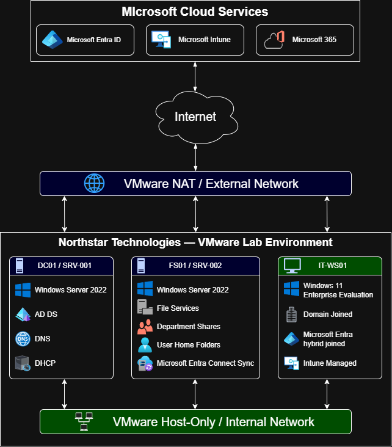

# Network Architecture

## Purpose

This document describes the network architecture used within the Northstar Technologies lab environment, including network topology, routing, DNS, DHCP and internet connectivity.

---

## Overview

The lab uses a dual-network architecture to separate enterprise services from internet connectivity.

Every virtual machine contains two network adapters:

- Internal Network
- External Network

This design closely resembles many enterprise environments where production traffic and internet access are separated.

---

## Design Principles

The network architecture follows the following principles:

- Separate internal enterprise services from internet connectivity.
- Use Active Directory as the authoritative DNS service.
- Route all internet traffic through VMware NAT.
- Maintain consistent IP addressing across all virtual machines.
- Ensure internal services remain isolated from the external network.

---

## Internal Network

Network

192.168.10.0/24

Purpose

- Active Directory
- DNS
- DHCP
- File Services
- Group Policy
- Authentication
- Internal communication

Characteristics

- Host-only VMware network
- No default gateway
- Windows DHCP Server
- Internal DNS

---

## External Network

Network

192.168.75.0/24

Purpose

- Internet connectivity
- Microsoft 365
- Microsoft Entra ID
- Microsoft Intune
- Microsoft Entra Connect synchronization
- Windows Update
- Software downloads
- Cloud services

Characteristics

- VMware NAT
- VMware DHCP
- Default gateway provided by VMware

---

## Routing Design

Only the External network adapter contains a default gateway.

The Internal adapter does not have a gateway configured.

This ensures:

- Internal traffic remains on the enterprise network.
- Internet traffic is routed through VMware NAT.
- Active Directory communication always uses the internal network.

---

## DNS Design

All domain-joined devices use DC01 (192.168.10.10) as their preferred DNS server.

Internal DNS queries are resolved by Active Directory DNS.

External DNS queries are forwarded by DC01 to public DNS forwarders.

This provides a single source of name resolution for all domain devices.

---

## DHCP Design

The lab uses two independent DHCP services.

- Windows Server DHCP provides addressing for the internal enterprise network.
- VMware DHCP provides addressing for the external NAT network.

Detailed DHCP configuration is documented in:

- 10_DHCP_Server.md

## Network Architecture Diagram

The following diagram provides an overview of the Northstar Technologies lab network architecture, including internal and external VMware networking, server infrastructure, workstation connectivity and Microsoft cloud services.

